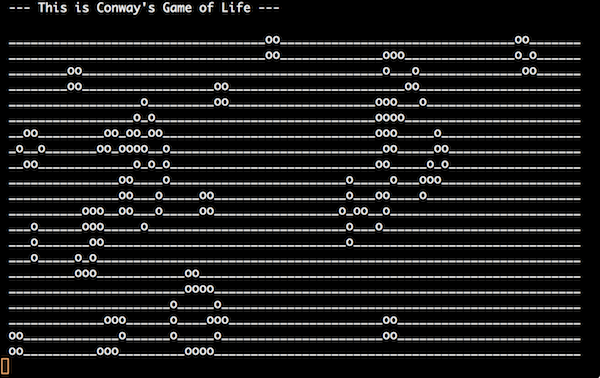

Conway's Game of Life in C#
==========

This is a simple console application visualizing a random start population in descrete steps (so called ticks) following the rules of [Conway's Game of Life](http://en.wikipedia.org/wiki/Conway's_Game_of_Life).

While developing it, I tried to follow the 9 rules of object calistenics:

1. Only One Level Of Indentation Per Method
2. Don't Use The ELSE Keyword
3. Wrap All Primitives And Strings
4. First Class Collections
5. One Dot Per Line
6. Don't Abbreviate
7. Keep All Entities Small
8. No Classes With More Than Two Instance Variables
9. No Getters/Setters/Properties

More about object calistenics can be found on various sites on the internet. This blogbost gives a nice summary:
http://williamdurand.fr/2013/06/03/object-calisthenics/
